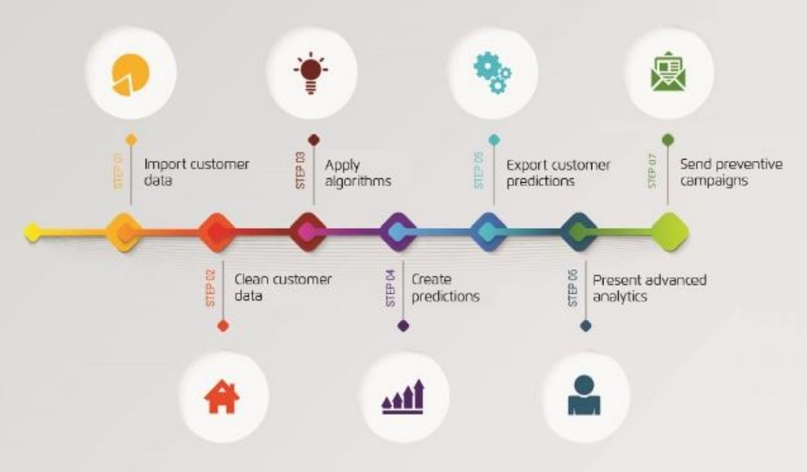

**Andrew Hahn**

**Submission: 27 June 2020**

**Fintech BootCamp**

**Synopsis:**

AdviceRobo is an international credit scoring company applying psychometrics and artificial intelligence (AI) to support lending to millennials and small, medium enterprises (SMEs).

It is chosen for the purpose of a case study because it provides a data solution to supplement a traditional approach to credit assessment and enables an efficient, accurate and cost effective service to providers of loans.

The service offering is uniquely positioned for growth and changes in underlying business circumstances. Part of this is due to the founders&#39; having a published authority in consumer marketing being particularly focused on the customer experience and their data interactions to offer a predictive outcome to manage loans and minimise defaults.

The company has received numerous awards for its technology and vision, and is one of the 8 Dutch companies in the European Fintech 100.

**Business Activities:**

AdviceRobo was incorporated in 2013 and was business enabled in the Netherlands in 2015 initially launching a psychographic credit scoring solution in the UK.

Over the past seven years, the company has developed innovative credit scoring solutions that leverage alternative data and artificial intelligence to extend their reach to 15 countries for lenders, including global Tier1 lenders, lending platforms, and online retailers with innovative risk solutions, significantly increasing operating profit.

AdviceRobo is now considered by KPMG as one of the world&#39;s most innovative financial risk specialists, providing customers with artificial intelligence and alternative data-driven risk services. It has offices in Amsterdam, London, Paris and Tokyo.

**Founders:**

Diederick Van Thiel s co-founder and CEO of AdviceRobo. Since 2009, Diederick has been a renowned name in the fintech industry, selling his startup eyeOpen to Aegon in 2013. He holds positions of influence as the Non-exec Director of Ikano Bank, and formerly on the board of ING and KPN Mobile. Diederick has been recognised as Fintech CEO of The Year by CEO Monthly Magazine.

Rosali Steenkamer is co-founder and CCO of AdviceRobo. She also founded eyeOpen, worlds&#39; first online mortgage advise platform that was sold to Aegon/Transamerica in 2013. Rosali developed her entrepreneurial skills as co-founder and COO of eyeOpen. Before she has held board positions at Alex Beleggersbank (CCO), American Express (CMO Benelux) and worked for many financial institutions such as ING.

**Business Case:**

The company was founded in 2013 and was product ready in 2015.

It commenced trading with start-up capital of $USD 600K, 15 employees and forward sales commitments of $USD 1.8M.

AdviceRobo&#39;s recurrent annual revenue FY 20 and 21 is currently $USD 5M per annum.

Product distribution strategy is direct to business (B2B), through financial institutions, through other fintech companies and platforms, which subscribe to a SaaS license. The starting cost for a user license is $USD 500 per month which provides platform access and then a scaled use cost dependent on the amount of customer credit searches undertaken.

Whilst this business might be considered a minnow in terms of its revenue position, from a Fintech perspective it provides important insights:

1. It is a start-up success story surviving well beyond the expected attrition period (90% of new start-up business do not last beyond 2 years)
2. It has fostered some key clients _(discussed later in this case study)_
3. It has a culture of evolution and continued product innovation _(discussed later in this case study)_
4. It provides a tangible solution to an identified problem _(discussed later on this case study)_
5. It does not require any further capital raisings to operate and grow its current revenue base

**Domain:**

The Fintech domain within which AdviceRobo mainly operates is Lending. A specific subset of Lending is Credit Assessment.

Its CreditRobo productoffers 3 services;

(1) early warnings on bad debt, default, pre-payments and outflow

(2) real-time behavioural dashboards of the risk development in the customer base and,

(3) real time behavioural credit scoring for instant onboarding, renewal and targeting of underserved groups like Millenials and SME&#39;s.

This provides benefits in increased customer loyalty, responsible handling of customers credit risk and profit enhancement by saving time and cost on credit risk.

There is a crossover into the domain of Wealth Management (WealthTech) where the field of Robo-Advising has become synonymous with A.I driven decisions based on data point inputs and consumer behaviour and risk preferences.

The broader application of AdviceRobo is also being innovated into the domain of Insurance (InsureTech) _(these are discussed later in the case study)_

**Product Solution:**

Understanding the Problem

In order to appreciate the solution, it is necessary to understand the problem that AdviceRobo seeks to address:

There are an estimated 4.5 billion people worldwide who do not have access to essential financial services with insufficient access to loans, because they have little or no credit history.

The recovery after the 2008 global credit crunch showed that global credit tripled, but only with a small group of people who could obtain the necessary credit score.

The COVID pandemic highlighted that governments and banks needed to provide huge amounts in new credit; or credit relief, to simply support the basic economy.

In addition the International Finance Corporation (IFC) estimates that 65 million firms, or 40% of small and medium enterprises (MSME&#39;s) in developing countries, have an unmet financing need of $5.2 trillion every year, which is equivalent to 1.4 times the current level of the global SME lending.

Research from the [Cambridge Centre For Alternative Finance](https://www.jbs.cam.ac.uk/faculty-research/centres/alternative-finance/) shows that credit markets around the world are undergoing a critical transformation with data-enabled Fintech firms seeking the market opportunity to provide lending to households and small businesses which are currently underserviced by traditional banks.

This is known as the &#39;thin file&#39; customer segment. In personal retail banking, banks typically use rough indicators for externally observed demographic or economic criteria, such as profession, age, income, or wealth. Unfortunately, this eliminates a large group of customers, those with thin credit files. Thin customer segments are predominantly seen in developing countries. However, even in more developed countries, millennials, self-employed people, ex-pats, startup entrepreneurs, and migrants, all are likely to have thin credit files.

Research from the traditional credit scoring service (FICO) illustrated above indicates the distribution of thin file customer segments. In the banking market, for example, 27% of population is new to credit and therefore have a thin-file. 17% of the population have lost access to credit, 28% of the population is creditor retired, and 34% of the population holds no credit file at all

The software enables lenders to target these underserved customers and streamline their credit processes, the software accelerates credit processes and, also identifies the key risk signals of existing clients.

The &#39;thin file&#39; customers, are all able to benefit from early identification of key risk signals.

An extreme scenario for the purpose of illustration might exist where six-month payment holidays are allowed for their mortgages, credit cards and other loans. But there is no visibility as to;

- Who of them is actually capable of paying their borrowed money back?
- Who is aware that money has to be put aside now for paying back?
- Who of them does understand how to prepare for repayments and thinks about repayment strategies?
- Who of them has the self-motivation to actually do so?
- Who of them has the skills to do it smartly without digging deeper financial holes?
- Who is actually willing to pay back the borrowed money?

In that extreme scenario it becomes important for lenders to assess risk and to also prepare personalized communication strategies for collection of payment holidays and loans in default. This replaces traditional credit assessments with risky customer segments being identified with a new type of credit review and scoring.

- Customers applying for a payment holiday.
- People who are in arrears.
- All new applicants for a credit.

The purpose of which is to save many millions in operational collection costs in the upcoming years.

Developing a New Approach

Traditional forms of credit scoring are retrospective and based on adverse historical events. These are easiest to undertake when a borrower has previously been provided with a form of credit and their real loan performance is reviewed against the necessary repayment calendar. This is known as the FICO score criteria (FICO stands for the Fair Isaac Corporation- the credit scoring agency that developed the model that now has universal adoption). However as can be seen in the following image there is now in the modern day much greater access to a much broader range of data sets which can be generally indicated as follows:

If a &#39;thin file&#39; customer has not had sufficient access to traditional credit and cannot obtain a FICO score then they have; until recently, been unable to access new credit. The new paradigm is to now enable a bespoke credit score based on multiple data points. As indicated in the following image, this increases the potential pool of creditworthy borrowers:

The additional alternative data offers a greater level of predictive outcomes. This is known as the GINI score (The GINI score is based on the equitable opportunity principles of an Italian economist who devised an index to illustrate divergence in outcomes based on social advantages existing within a country). The GINI reference as applied to credit scoring, is simply to indicate that a fairer assessment can be made when other factors are added to an individual circumstance.

A white paper they published shows that while the Gini index for the resource score based on credit-bureau data alone was very low. The Gini index for the score based on both bureau and alternative data increased substantially. This brought the models predictive strength pretty similar to traditional FICO score to customers with new credit histories. Their model looks at a number of factors that are likely to predict risk.

As indicated below a credit provider OnDeck) which uses an internally configured bespoke credit score solution suggest that they can consistently achieve a better predictive outcome of impending default by overlayting alternative data points rather than relay upon the traditional standalone FICO score.

This is because the additional of data points refines the score to individual situations.

The AdviceRobo Solution

AdviceRobo applies psychometric processing to make assessments of the credit profile of a person or entrepreneur. Psychometrics is a branch of psychology that designs assessment tools to measure personality traits, skills, knowledge, abilities and attitudes. These tools have been proven in human resources planning and marketing.

The CEO notes _&quot;We leverage the psychographic and behavioural data explosion into smart risk robots that improve lenders revenue and reduce their operational and risk costs big time&quot;_ Diederick van Thiel

Essentially AdviceRobo has created a credit intelligence platform which combines psychographic profiles, screen behaviour, browser and device information with transaction data to give a humanized credit profile.

The software leverages machine learning in a SaaS environment to use deep scientifc knowledge to apply psychographics to scoring models. The platform works by offering an intelligent dashboard for financial services providers that collects customer response data from over 1,000 data points.. Data point assessment categories include;

AdviceRobo provides this service as a white label integration (which the credit provider can brand) for a seamless and bespoke customer experience.

Through a virtual experience and within a matter of seconds the credit provider gets the applicant&#39;s credit score and a short profile via an application programming interface (API). Based on this, the lender can instantly either approve or reject the applicant within its lending parameters. This technology has been proven accelerate acceptance timeframes (+18%) and with confidence (providing the same or better risk levels up to 38% lower than average default rate).

AdviceRobo indicate their service scored over 2 million people of the past 5 years, either as stand-alone or as extension of existing credit systems. The platform has helped 20% of applicants to get a loan confidently and safely. These same people are those Thin File customers who would have been rejected in the traditional FICO system, and performance results indicate that default rates within this sample group were 20% lower than the average base default rate.

Value Proposition:

The workflow architecture of the AdviceRobo service is a machine learning platform that accurately predicts consumers&#39; risk behaviour by combining structured and unstructured client data.

This can be illustrated as follows:

The alternative data sets are collated and filtered. The psychometric scoring offers an opportunity for credit providers to help customers build and strengthen their financial health. At the same time, it allows them to deeply learn about their customers, understand their needs, and empower them with financial intelligence.

Advice Robo undertakes this with a simple &#39;personality&#39; test which measures the creditworthiness of an applicant, the test gives insights into their ability to mitigate risks, their understanding of financial concepts such as pension and inflation, and their capacity to manage such as repayments.

Benefits of the test include:

• Improve screening of new applicants

• Increase acceptance at same or better risk levels, and at a reduced cost

• Enable lenders to learn deeply about their customers, understand their needs and access to credit

• Easy to integrate into the consumer journey

This enables lenders to properly predict and prevent credit risks during the customer lifetime.

Performance Outcomes

Performance metrics indicate that global market leading banks like BNP Paribas and others have experienced compelling benefits by using AdviceRobo solutions: 15% more sales at a 20% lower default rate, and over an 20% operational cost reduction. Their banking clients have awarded them the highest NPS (Net Promoter Score) in the market.

**Key Partnerships**

Microsoft and KPMG

In partnership with KPMG and Microsoft, AdviceRobo has launched a categorisation robot to help lenders make better credit decisions under the revised Payments Services Directive (PSD2).

CatRobo is Europe&#39;s first pan-European categorisation and default prediction API, which uses transactional data to enhance the decisioning process. CatRobo categorises 70% of transactions automatically and is powered by artificial intelligence (AI) and behavioural and psychographic modelling The API automatically translates different data formats for Dutch banks and can then be customised for banks in other countries.

AdviceRobo&#39;s CEO, says: &quot;_It serves the need in credit risk management to get more grip on the quality of the customer base. Also, the close cooperation with KPMG in this makes me proud. It shows the power of our cooperation to create a more financially healthy world.&quot;_ Diederick van Thiel,

NIBC

NIBC is an enterprising Dutch bank that offers multi-sector corporate finance. Through NIBC Direct, Retail Banking provides mortgage loans in the Netherlands and online savings products in the Netherlands, Belgium and Germany. NIBC Direct (NIBC) works with AdviceRobo to help it pro-actively flag mortgage clients that could fall into default. NIBC is continuously looking for ways to provide its support to clients at an early stage and uses the AdviceRobo inventive machine learning technology to approach these clients personally and in time. NIBC provides the following capability statement as to AdviceRobo&#39;s services;

&quot;_Thanks to the early warnings from the inventive AdviceRobo solution, we are even better placed to get in touch with clients proactively. Based on segmentation, we determine which clients would be best to approach first and what solutions to offer them. By doing so, NIBC is taking an important step towards leveraging FinTech tooling to improve its client service. Common reasons for defaulting on a mortgage are unemployment, illness or divorce. In addition to an emotional impact, this also tends to have financial implications, for instance for making monthly interest payments and/or mortgage repayments. NIBC applies the AdviceRobo machine learning tool in its active servicing to demonstrate it undertakes its social responsibility seriously&quot;_

ORIX

ORIX Credit is a Japanese company which operates in three core retail businesses: a loan business, a credit guarantee business, and a mortgage banking business. The loan business primarily provides unsecured loans to individual customers. The credit guarantee business guarantees unsecured loans mainly handled by financial institutions based on Orix&#39;s credit expertise. The mortgage banking provides housing loans. Orix utilises AdviceRobo&#39;s psychometric evaluation and scoring into its loan approval processes. Orix provides the following capability statement as to AdviceRobo&#39;s services;

&quot;_AdviceRobo credit scoring helps Orix with a broad-based credit scoring mechanism beyond the traditional parametersemployed by agencies and credit bureaus. The biggest beneficiaries of this innovative credit scoring are Orix consumers who are new to the credit and financing ecosystem. For_

_such new consumers, there is no sufficient centralized data available. But that doesn&#39;t mean that they cannot avail of credit&quot;_

**Competitors**

The alternative data approach which AdviceRobo applies is used by a number of other competitors who are also using very similar technology but seeding data from different sources such as product purchases. Examples of these kinds of credit providers are Klarna in Sweden (Payments) and Kreditech in Germany (Consumer Loans).

An interesting application is demonstrated below with an African credit provider &#39;Tala&#39;, it makes loans using alternative data derived from smartphone usage (eg location, movement and call length) to model its own score of creditworthiness.

An industry determined list of competitors to AdviceRobo in the field of credit scoring noted that the these were:

- First Access: annual revenue $5M, staff =25
- Destacame: annual revenue $7M, staff = 34
- Kindur: annual revenue $5M, staff = 25
- Forward Lane: annual revenue $5M, staff = 25
- Essentia Analytics: annual revenue $6M, staff = 31

**Domain Trends**

The use of Robo-Advisors in the Lending domain is evolving to bring forward a more humanistic approach.

Academic research shows that customers expect five factors from a robo-advisor: Advising qualities, Process influence, Price, Advice depth and Accessibility.

As a first step If these factors are properly applied banks can provide the best customer experience. The next trend will then be to offer service differentiation based on psychological and motivational profiles.

The CEO of AdviceRobo indicates _&quot;At the moment &#39;robo advice&#39; is a one size fits all solution. This could be much better, much more tailored, If we can capitalise on the psychometric profiles of customers, a robo advisor may become really personal and the customer experience with it,&quot; Diederick Van Thiel_

By way of example a Digital Customer Experience (DCX) model developed AdviceRobo provides insights how to make advice more personal, by really understanding the customer&#39;s behaviour and their needs. just as a personal financial adviser would do.

Applying this methodology, low financial knowledge and financial skills of young people can be detected before digitally purchasing expensive goods with loans (such as BNPL). Understanding an individual&#39;s personal traits like their level of materialism and need for instant gratification help for offering financial solutions that are affordable to their lifestyle and income or, even better, improve their financial health.

[AdviceRobo](http://www.advicerobo.com/) for example discovered in their 2.5 million scored consumers &amp; small businesses that there is a wide range across geographies when it comes to their scores on spending habits, financial skills, debt attitudes, drive for materialism and instant gratification. Scores that impose a different way of living, risk and opportunity profiles

In a recent report by the Boston Consulting Group it was noted that banks increasingly need to put in place individual company and consumer stress tests to anticipate looming credit problems because legacy IT platforms prevent a clear picture from emerging.

A good example was highlighted with the loan deferrals during the COVID pandemic which was not captured by credit-ratings systems.  The key consideration with credit providers is how to enable contact strategies to collect the money in a sustainable way.

The pandemic provided an example of just how relevant alternative data can be. In a few months, consumer purchasing habits, activities, and digital behaviour changed dramatically, making pre-existing consumer research, forecasts, and predictive models obsolete.

As organizations have struggled to understand these changing patterns, they discovered little of use in their internal initial application data. Meanwhile, a developing trend is to respond at a granular, real time level leverage the wealth external data that can be available.

Credit providers that stay abreast of the expanding external-data ecosystem and can successfully integrate a broad spectrum of alternative data into their operations can potentially outperform other companies by unlocking improvements in growth, productivity, and risk management.

Examples of alternative data sets include; credit card transaction data, mobile device data, IoT sensor data, satellite imagery, social media sentiment, product reviews, weather data, web traffic, app usage and ESG (environmental, social and corporate governance) psychometric data, browser events and biometry for granular predictive insights that advance credit decisioning and customer activation.

**Sustainability**

The seamless integration of financial services adopted by non-financial companies is enabling more sustainable business models through the concept of embedded finance. The merger between non-financial entities and embedded finance services has revolutionised the way consumers of the future will interact with money and businesses. There are a multitude of Fintech companies seeking to operate in this space. Innovation in credit scoring has a broader application with Payments, Business Funding and Insurance.

Application to Payments/NextGen

Omnichannel digital payments, mobile wallets and buy-now-pay-later are forms of embedded finance. [PWC research](https://www.pwc.com/gx/en/industries/financial-services/publications/financial-services-in-2025/payments-in-2025.html) foresees a 42% increase of cashless payments towards 2025. The same research expects that 90% of bank&#39;s useful consumer data comes from payments. Google, Amazon, Apple have already launched behavioural data-generation tools in all aspects of our lives and are embedding personal finance to that. Access to all this data will give a huge advantage in applying AI for personal services and offers at scale if they can respond well to the societal &amp; purposeful context of the next generations.

Expectations for personal, bespoke, and innovative products mean nextgen banks are prioritizing data analytics tools. However, making things personal requires deep understanding of and responding to the societal &amp; behavioural context in which these generations live, and their preferences are shaped.

AdviceRobo aims to be a leading technology in NextGen finance. By demonstrating inclusion capability for woman, farmers and small businesses it can transform credit decision making while new data and AI open massive opportunities to the nextgen banking customer. All strategic players have come to the realization that nextgen banking customers are their primary profit pool as of 2025.

Application to Venture Capital Investing

AdviceRobo is evolving its AI platform from credit decision making to the start-up investment decision making market. The unstable macro-economic environment makes it increasingly difficult and expensive to decide in which business to invest (or not) especially when there is a flood of new start-ups competing in the same capital pool.

Access to finance is indicated by 50% of small businesses as the major hurdle. Because of lacking or inaccurate data it is often hard tor VC firms to reach them commercially. With an alternative data solutions an investor can signal the right businesses for funding and improve Venture Capital investment returns by 40%.

AI and data tech are transforming early-stage venture capital investments. Large VC&#39;s will develop their own strategies and technology inputs inhouse but for the smaller VC&#39;s, AdviceRobo is developing an externally ready solution.

Application to Insurance

AdviceRobo integrates new technologies to discover and monitor patterns that strongly enables risk reduction. This assists insurers in several ways. On the one hand to reduce risk and prevent loss; on the other hand to improve customer engagement and add new value to customers.

Through the application of artificial intelligence as well as gamification to prevent financial risks. AdviceRobo can predict portfolio risks supporting insurers to campaign proactively.

AdviceRobo &#39;solution lies in applying psychographics combined with financial and other behavioural data to create insights into risk prediction and retirement gap prevention. The concept is for insurer&#39;s to enable an AdviceRobo virtual assist virtual assistant to support customers in preventing financial stress after retirement.

**Conclusions &amp; Recommendations**

The CAGR for digital lending is 53 per cent until 2025. AdviceRobo offers a new model for credit risk scoring which can become a key advantage for the sustainability of a financial institution.

Scalable automated credit risk solutions which build on AI in their risk scoring applying both structured and unstructured data will become increasingly prevalent as borrowers and businesses seeking finance adapt to new ways of interaction and undertaking work.

AdviceRobo has devised a solution which improves the credit decisioning process by providing lenders credit software to expand their services in the &#39;thin file&#39; customer segments. This includes borrowers such as SMEs, self employed people, migrants, millennials; in the western countries, and also billions of consumers in developing countries.

Most finance providers are not yet that advanced to apply a wide set of behavioural and attitudinal data for deep customer profiling. However, alternative data and AI are increasingly becoming available to facilitate safe automatic embedded consumer decision making that helps consumers to get and maintain a sustainable financial life.[Bain Capital Ventures](https://www.bain.com/insights/center-stage-with-consumers-and-regulators-bnpl-report-2021/) estimates the opportunity of expanding personal finance in these embedded environments from payments to insurances, lending and wealth management at a $7 trillion market by 2030.

**References**

WEBPOSTS

[https://advicerobo.com/the-problem-we-solve/](https://advicerobo.com/the-problem-we-solve/)

[https://advicerobo.com/eat-or-be-eaten/](https://advicerobo.com/eat-or-be-eaten/)

https://advicerobo.com/digital-advice/

ARTICLES

\&lt;[https://advicerobo.com/wp-content/uploads/2020/06/20200610-PRESS-RELEASE-ORIX-Credit-and-AdviceRobo-collaborate-EN-Final.pdf](https://advicerobo.com/wp-content/uploads/2020/06/20200610-PRESS-RELEASE-ORIX-Credit-and-AdviceRobo-collaborate-EN-Final.pdf)\&gt;

\&lt;[https://advicerobo.com/wp-content/uploads/2019/11/MyCreditRobo-2.pdf](https://advicerobo.com/wp-content/uploads/2019/11/MyCreditRobo-2.pdf)\&gt;

\&lt;[https://www.professionalplanner.com.au/wp-content/uploads/2016/09/viewpoint-digital-investment-advice-robo-sep-2016\_Aust.pdf](https://www.professionalplanner.com.au/wp-content/uploads/2016/09/viewpoint-digital-investment-advice-robo-sep-2016_Aust.pdf)\&gt;

\&lt;[https://www2.deloitte.com/content/dam/Deloitte/de/Documents/financial-services/Deloitte-Robo-safe.pdf](https://www2.deloitte.com/content/dam/Deloitte/de/Documents/financial-services/Deloitte-Robo-safe.pdf)\&gt;

[https://www.nibc.com/media/1554/fintech-advicerobo-helps-prevent-late-payments-nibc-clients.pdf](https://www.nibc.com/media/1554/fintech-advicerobo-helps-prevent-late-payments-nibc-clients.pdf)

[https://www.dbresearch.com/PROD/RPS\_EN-PROD/PROD0000000000449125/Robo-advice\_%E2%80%93\_a\_true\_innovation\_in\_asset\_managemen.pdf](https://www.dbresearch.com/PROD/RPS_EN-PROD/PROD0000000000449125/Robo-advice_%E2%80%93_a_true_innovation_in_asset_managemen.pdf)

https://h2.vc/reports/Fintech100-2017.pdf

[https://next.digitalinsuranceagenda.com/wp-content/uploads/2020/03/DIA-TOP-100-2017.pdf](https://next.digitalinsuranceagenda.com/wp-content/uploads/2020/03/DIA-TOP-100-2017.pdf)

https://www.emerce.nl/wire/advising-qualities-are-the-most-important-factor-robo-advice

BLOGS

[https://www.finextra.com/blogposting/22145/the-embedded-finance-transformation-think-big-think-smart-be-bold-and-do-it](https://www.finextra.com/blogposting/22145/the-embedded-finance-transformation-think-big-think-smart-be-bold-and-do-it)

https://www.finextra.com/blogposting/22049/cool-revolutionize-customer-experience-for-embedded-finance

[https://www.finextra.com/blogposting/21248/game-changers-for-sme-banking](https://www.finextra.com/blogposting/21248/game-changers-for-sme-banking)

[https://www.finextra.com/blogposting/21388/game-changers-harnessing-the-power-of-alternative-data](https://www.finextra.com/blogposting/21388/game-changers-harnessing-the-power-of-alternative-data)

https://www.finextra.com/blogposting/21156/game-changers-for-next-gen-banking

TWEETS

[https://twitter.com/cooladvicegames?lang=en](https://twitter.com/cooladvicegames?lang=en)

Diederick van Thiel

@CoolAdviceGames

CEO _AdviceRobo_ | Non-exec IKANO Group | Angel Invest | Entrepreneur | PhD Human Centered AI| Author &quot;Riding the waves&quot; and &quot;Cool&quot;

[https://crozdesk.com/compare/advicerobo-vs-traklight-vs-iauditor](https://crozdesk.com/compare/advicerobo-vs-traklight-vs-iauditor)
